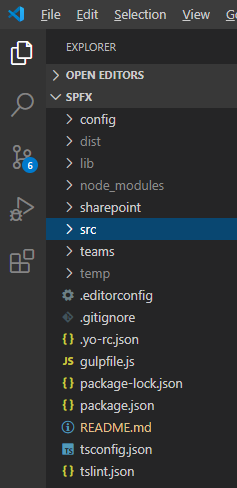
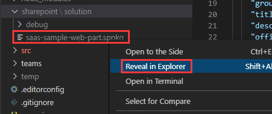
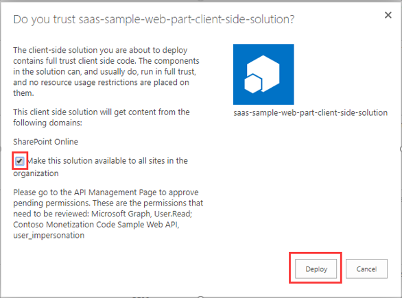
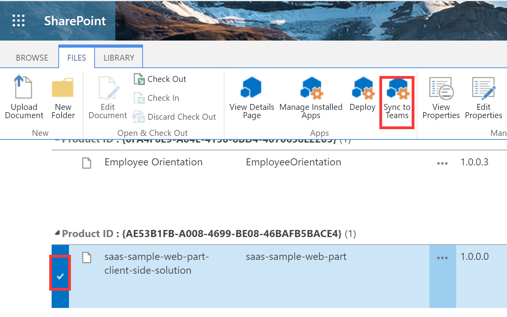
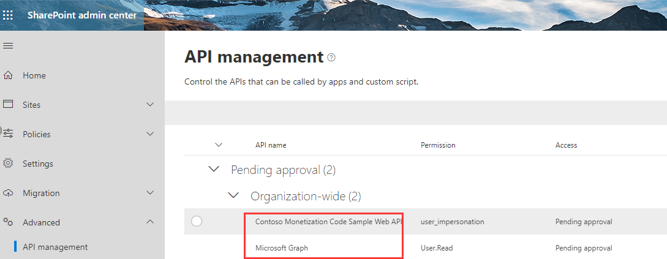
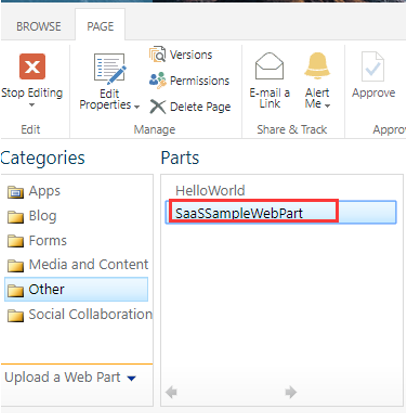

# Monetization SPFx

# Installation

1. In the Azure Portal, copy the Contoso Monetization Code Sample Web API Application **Display Name** and **Application ID** and paste it into a text file. You will need them in subsequent steps.

   

2. Copy the Contoso Monetization Code Sample Web API **URL**  and paste it into a text file. You will need it in subsequent steps.

   

3. Download the [SPFx source code](../../MonetizationCodeSample/SPFXAddIn), and open it using Visual Studio Code.

   

4. Open the **package-solution.json** file in the config folder, then paste the Contoso Monetization Code Sample Web API Display Name that you copied in step 1 into the resource value on line 12. **Save** the file.

   

5. Open the **SaaSSampleWebPartWebPart.manifest.json** file 

   

6. Paste the Contoso Monetization Code Sample Web API **Application ID** that you copied in step 1 into the **clientId** value on line 25.

   

7. Paste Contoso Monetization Code Sample Web API **URL** that you copied in step 2 into the **sassWebApi** value on line 25.

	>**Note:** You are only replacing a portion of the URL.  Refer to the picture below to see which portion of the URL to replace.**
	

 	**Save** the file.

   

8. Execute the following commands in the terminal to build, bundle, and package the SPFx Add-in.

   ```
   npm install
   
   gulp build
   
   gulp bundle --ship
   
   gulp package-solution --ship
   ```

9. Open the folder the packaged file was generated in and located the **saas-sample-web-part.sppkg** file.  Note the file path to the package file, you will need it in the next step.

   

10. Open your SharePoint App Catalog and upload the SPFx package file.

   

11. Select the **checkbox** and click **Deploy**.

    

12. Select the **saas-sample-web-part-client-side-solution** Add-in, then in the Ribbon, click **Sync to Teams**.

    

13. Go to the SharePoint Admin Center.

14. Open **API management** and approve the following two permissions.

    

15. Approve successfully.

    

16. Go to a SharePoint site and edit a page. Add the SaaSSampleWebPart to the page.

   

15. Save the page and observe the license status in the web part and developer console.

    