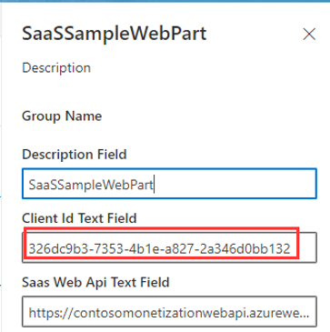
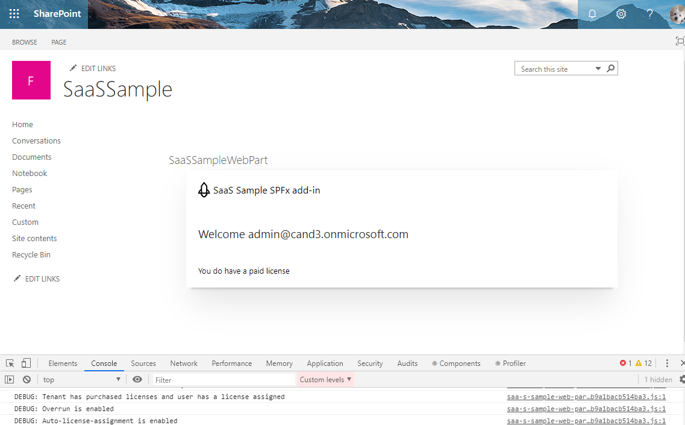

#                    Monetization SPFX

1.  Download the latest SPFX [**saas-sample-web-part.sppkg**](saas-sample-web-part.sppkg) package file.

2.   Open your SharePoint Catalog  https://cand3.sharepoint.com/sites/AppCatelog/AppCatalog/Forms/AllItems.aspx, upload SPFX package file to SharePoint Catalog.

   

3. Select Checkbox and click Deploy button.

   

4. Select **saas-sample-web-part** file, then select **Sync to Teams** menu.

   

5. Go to SharePoint Admin Center.

6. Open **API management** and approve the following two permission.

   

7. Approve successfully.

   

8. Open SharePoint site a page and edit this page.

9. Add SaaSSampleWebPart into this page.

   

10. Edit this Webpart, click Configure button.

   

11. Copy Contoso Monetization Code Sample Web API Client Id and paste it  

    

    

12. Copy Contoso Monetization Code Sample Web API URL

    

13. Replace WebAPI URL using URAL was copied above, then past it SaaS Web API Text Field.

    [**https://YOURContosoMonetizationCodeSampleWebAPIURL**/api/Subscriptions/CheckOrActivateLicense/contoso_o365_addin](https://YOURContosoMonetizationCodeSampleWebAPIURL/api/Subscriptions/CheckOrActivateLicense/contoso_o365_addin)

    

14. Save configure and stop editing.

15. Return to SharePoint page and check SPFX.

    